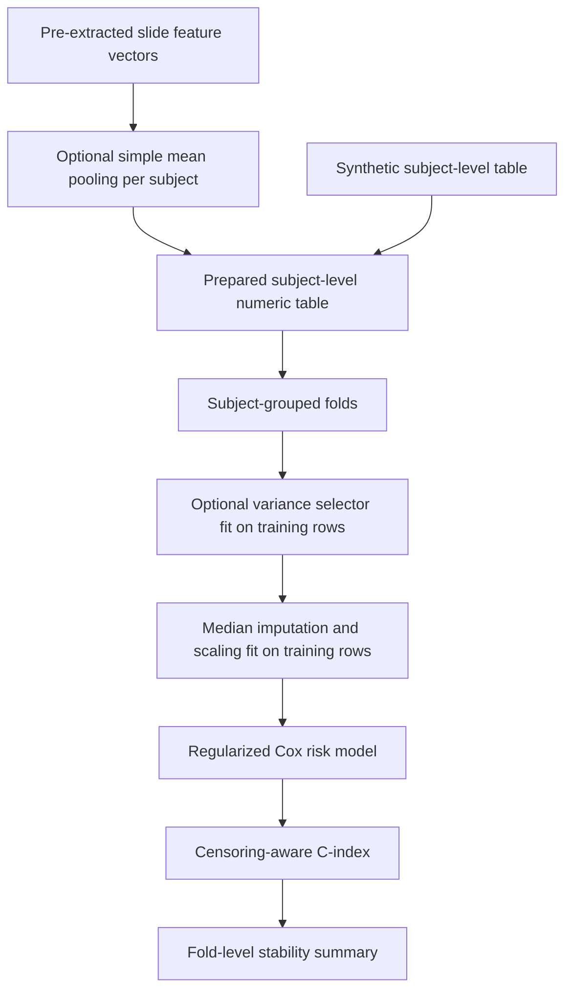

# Multimodal Cancer Prognosis

**Leakage-aware reference workflow for multimodal biomedical survival-risk modelling with patient-level validation.**

This repository demonstrates a small, reproducible workflow for retrospective censored time-to-event analysis: define a subject-level table, keep subjects together during splitting, fit learned preprocessing inside each training fold, fit a regularized Cox model, and evaluate censoring-aware risk ranking.

Pathology inputs are assumed to be pre-extracted numeric slide features. A utility can mean-pool repeated slide vectors to a subject-level vector. The repository does not extract whole-slide image features or implement learned MIL, teacher/student distillation, HyperBank/HGNN, or cross-modal attention.

*Public methodology workflow implemented in this repository.*

## Overview

This repository is a clean, reusable workflow for biomedical survival-risk modelling with prepared subject-level features. It emphasizes patient-level validation: subjects stay together during splitting, learned preprocessing is fitted inside each training fold, and a regularized Cox model is evaluated with a censoring-aware C-index.

In this schema, `subject_id` identifies the patient-level subject. Raw study data and pretrained model weights are not included.

> **Research background.** This public methodology reference grew out of a broader retrospective TCGA-BRCA multimodal cancer-prognosis project exploring whole-slide-derived pathology representations, mRNA expression, clinical information, attention-based MIL, multimodal fusion, Cox-style survival objectives, and privileged clinical information. This repository extracts reusable validation and preprocessing methodology; it does not reproduce the full historical research codebase.
>
> See [Project Background](docs/project_background.md) for context on the broader project and this public reference.

## Quick links

- [Project background](docs/project_background.md)
- [Methodology](docs/methodology.md)
- [Validation principles](docs/validation.md)
- [Reproducibility](docs/reproducibility.md)
- [Data availability](docs/data_availability.md)

## Key features

- Subject-grouped validation folds and overlap checks
- Optional training-fold-only top-variance feature selection
- Training-fold-only median imputation and standardization
- Simple case-level mean pooling for pre-extracted slide features
- Ridge-regularized linear Cox survival-risk modelling
- Censoring-aware C-index and split-stability summaries
- Synthetic-only tests and smoke workflows

## Methodology

### Cohort and subject grouping

The loader expects one row per subject with a subject_id, follow-up time, event indicator and numeric features. Repeated slide rows must be aggregated first. The code keeps the subject-level unit explicit and avoids logging subject keys.

### Fold-local preprocessing

If feature selection is enabled, the selector is fitted on the training rows in each fold. Imputation medians, means and scales are also fitted on the training rows, then applied unchanged to that fold's validation rows.

### Molecular and pathology-derived features

Numeric columns may contain prepared molecular, clinical or pathology-derived features supplied by the user. The optional selector is a generic variance filter; it does not define a biological marker panel. The slide utility mean-pools pre-extracted feature vectors only. Raw assay processing, slide tiling, feature extraction, modality joins, learned MIL and cross-modal fusion are outside the current implementation.

### Survival modelling and evaluation

The reference model is a ridge-regularized linear Cox model. Harrell-style C-index evaluates risk ordering for comparable censored observations. It is not diagnostic accuracy, sensitivity/specificity, calibrated event probability or clinical utility.

## Quick start

Use Python 3.10, 3.11, or 3.12 (the versions covered by CI).

~~~
python -m pip install -r requirements.txt pytest
python -m compileall src scripts tests examples
pytest -q
~~~

## Synthetic demo

**Synthetic software demonstration only. These data and any resulting metrics are not scientific results.** The training and evaluation tables use disjoint synthetic subject_id prefixes.

~~~
python examples/synthetic_example/generate.py --output /tmp/survival_train.csv --subjects 80 --seed 17 --id-prefix SYNTH_TRAIN
python examples/synthetic_example/generate.py --output /tmp/survival_eval.csv --subjects 40 --seed 29 --id-prefix SYNTH_EVAL
python scripts/prepare_data.py --input /tmp/survival_train.csv
python scripts/train.py --train-csv /tmp/survival_train.csv --model-out /tmp/cox_model.json --epochs 40
python scripts/evaluate.py --input-csv /tmp/survival_eval.csv --model /tmp/cox_model.json
python scripts/run_stability_analysis.py --input-csv /tmp/survival_train.csv --folds 3 --seed 11 --epochs 40
~~~

Example schema-check output (abbreviated):

~~~json
{"schema_valid": true, "subjects": 80, "features": 3, "missing_feature_cells": 1}
~~~

The evaluate and stability commands print synthetic C-index values for software checks only. Do not interpret or quote them as scientific results.

## Repository structure

- src/cancer_prognosis/: cohort schema, pooling, grouped splits, optional feature selection, preprocessing, survival model and metrics
- scripts/: data validation, training, evaluation and stability commands
- configs/: example configuration schema
- examples/synthetic_example/: synthetic data generator
- tests/: unit and synthetic workflow tests
- docs/: methodology, validation, reproducibility, data availability and project background
- .github/workflows/: continuous integration

## Validation principles

Use a patient-level subject key; keep each subject in one split; fit feature selection, imputation and scaling within training folds; separate model selection from final evaluation; report the intended endpoint and uncertainty. Synthetic data only test software paths.

## Data availability

No TCGA/CPTAC raw data, patient tables, pathology images, molecular matrices, embeddings, predictions, checkpoints or feature caches are included. Obtain data from an official source such as the [NCI Genomic Data Commons](https://portal.gdc.cancer.gov/) and comply with its access/use terms and any applicable institutional requirements.

## Scope and provenance

The public code is a newly authored, clean methodology reference. It is not the exact source snapshot for the historical Phase4 experiments and does not reproduce historical results or the full thesis-era architecture. The exact historical TCGA endpoint-construction logic is not encoded here; the public reference intentionally uses a generic censored time-to-event schema.

## Limitations

This reference does not extract pathology features, process assays, perform batch correction, estimate calibrated absolute risk, provide external validation, or establish a biomarker. The model and examples are not a clinical product.

## Clinical disclaimer

**Research use only. Not intended for clinical decision-making, diagnosis, screening, treatment selection, or patient management.** This software has not been clinically validated or approved for clinical use.

## License and source identity

No license file is included; no license grant should be inferred. The original research source, historical experiment artifacts and third-party architecture code are not distributed here.
